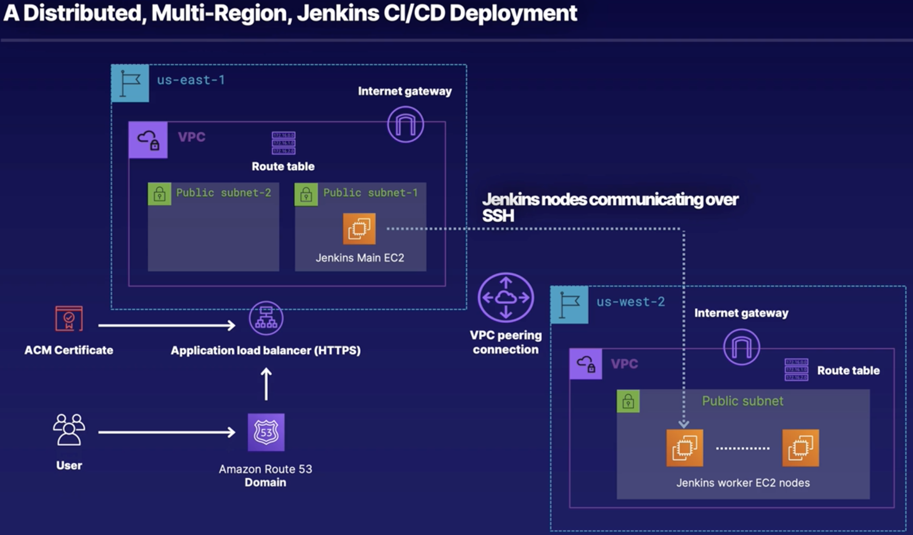
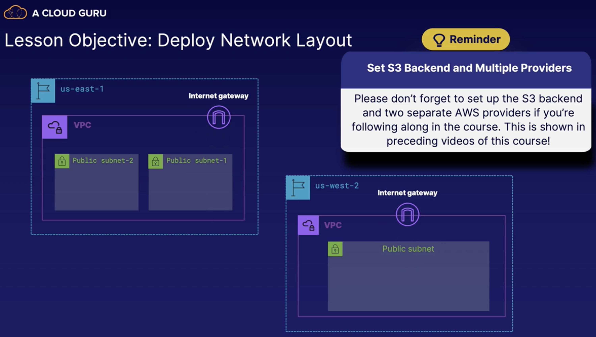

# awscode

**Terraform** starter project for **Amazon Web Services (AWS)**.

<!-- TOC -->

- [awscode](#awscode)
- [TL;DR](#tldr)
- [Setup Your Environment](#setup-your-environment)
- [Setup AWS IAM Permissions for Terraform](#setup-aws-iam-permissions-for-terraform)
  - [Create IAM Policy](#create-iam-policy)
  - [Attach Policy to IAM User](#attach-policy-to-iam-user)
- [Terraform Infrastructure as Code (IaC)](#terraform-infrastructure-as-code-iac)
- [Persist Terraform State in S3 Backend](#persist-terraform-state-in-s3-backend)
  - [Create AWS S3 Bucket](#create-aws-s3-bucket)
  - [Create a TF backend](#create-a-tf-backend)
  - [Terraform Fmt and Init](#terraform-fmt-and-init)
- [Setup Multiple AWS Providers in Terraform](#setup-multiple-aws-providers-in-terraform)
  - [Create a TF variable file](#create-a-tf-variable-file)
  - [Create a TF providers file](#create-a-tf-providers-file)
  - [Terraform Fmt and Init](#terraform-fmt-and-init)
- [Network Setup Part 1: Deploying Virtual Private Clouds, Internet Gateways, and Subnets](#network-setup-part-1-deploying-virtual-private-clouds-internet-gateways-and-subnets)
  - [Create a TF networks file](#create-a-tf-networks-file)
- [Create VPC in us-east-1](#create-vpc-in-us-east-1)
- [Create VPC in us-east-1](#create-vpc-in-us-east-1)
- [Create VPC in us-west-2](#create-vpc-in-us-west-2)
- [Create IGW in us-east-1](#create-igw-in-us-east-1)
- [Create IGW in us-west-2](#create-igw-in-us-west-2)
- [Get all available AZ's in VPC for main region](#get-all-available-azs-in-vpc-for-main-region)
- [Create subnet #1 in us-east-1](#create-subnet-1-in-us-east-1)
- [Create subnet #2 in us-east-1](#create-subnet-2-in-us-east-1)
- [Create subnet in us-west-2](#create-subnet-in-us-west-2)
- [Network Setup Part 2: Deploy Multi-Region VPC Peering](#network-setup-part-2-deploy-multi-region-vpc-peering)
- [Header](#header)
- [References](#references)

<!-- /TOC -->

# TL;DR

We will be deploying a distributed, dual-region, **Jenkins** CI/CD pipeline. We'll start by deploying a *Virtual Private Cloud (VPC)* and _public subnets_ in both regions, as well as _security groups_.

Next, we will be deploying VPC pairing between the two VPCs in both regions. To support communication between the regions, we will alter the _route tables_ accordingly.

After that, we will attach _Internet gateways_ to VPCs in both regions to allow the **Elastic Compute Cloud (EC2)** instances that we deploy later on to connect to the Internet.

We will deploy our EC2 instances, which runs our Jenkins main node and worker nodes in separate regions, hence making it distributed. **Ansible** will kick in during this part to install the required software for Jenkins and apply configuration to integrate worker nodes with the main Jenkins node.

We will put our Jenkins main node behind an _application load balancer (ALB)_ and generate an _SSL certificate_ using **AWS Certificate Manager (ACM)** and attach it to our ALB to allow _HTTPS_ traffic.

The ACM certificate will be verified against a _domain name_ in a **Route 53** public hosted zone before it can be functional. And wrapping it all up, we will route our DNS queries via Route 53 domain towards our ALB DNS name to allow traffic from the outside world.



# Setup Your Environment

This project requires several tools installed. If you haven't already installed these, go through the steps below and ensure that you have at least an equal or greater version of each tool listed below.

<details>
  <summary>Click to setup your environment.</summary>

* Install **Terraform** 0.12.29+

> [Installing Terraform](https://learn.hashicorp.com/tutorials/terraform/install-cli)

* Install **Python3 ** and **Pip3 Package Manager**

> [Python 3 Installation & Setup Guide](https://realpython.com/installing-python)

* Installing **AWS CLI** 1.18.103+

```sh
pip3 install awscli --user
```

* Installing **Ansible** 2.9.11+

```sh
pip3 install ansible --user
```

* Download `ansible.cfg` from this repository root folder into your project folder. 

This file configures the Ansible behavior, and to ease SSH access to systems. By default, Ansible will pick up any configuration file in the same folder as where the command is ran.

* Create an IAM user in your AWS account.

> [Creating an IAM user in your AWS account](https://docs.aws.amazon.com/IAM/latest/UserGuide/id_users_create.html)

* Create an IAM group in your AWS account.

AWS IAM has a concept of Groups which is a collection of IAM users and enables you to set permissions for multiple users. These Groups ease the management of users & their permissions.

From the IAM Console:

1. Click Groups > Create New Group button.
2. Specify a New Group Name. Use a meaningful descriptive name. I’ll be using `awscode-group`.
3. Add users to the group > Click on the IAM user that you created above.
4. Attach permission policies > Click on the following policy names:
  * AmazonEC2FullAccess
5. Click Create Group button.

You should now see your newly created group in the list. We will be looking at AWS IAM Permissions more thoroughly in the next section.

* Get your AWS account credentials.

> [Get Access Key ID and Secret Access Key of AWS account](https://supsystic.com/documentation/id-secret-access-key-amazon-s3)

Finally we will configure our AWS CLI with our AWS account credentials.

* Configure AWS CLI

```sh
aws configure
```

```sh
AWS Access Key ID [None]: <aws_access_key_id>
AWS Secret Access Key [None]: <aws_secret_access_key>
Default region name [None]: us-east-2
Default output format [None]: json
```

* Test AWS CLI

```sh
aws ec2 describe-instances
```

</details>

# Setup AWS IAM Permissions for Terraform

Terraform will need permissions to create, update, and delete various AWS resources. You can do either of the following depending on how you're deploying:

* Create a separate IAM user with required permissions.

* Create an EC2 (IAM role) instance profile with required permissions and attach it to EC2.

<details>
  <summary>Click to setup your AWS IAM permissions for Terraform.</summary>

## Create IAM Policy

IAM Policies are stored in AWS as JSON documents. AWS basically has two categories of policies: _managed policies_ and _inline policies_.

* _Managed policies_ are standalone identity-based policies that are created and managed by AWS.

* _Inline policies_ are policies that you create and manage, and that are embedded directly into a single user, group, or role.

We have provided two _inline policies_ to manage IAM permissions for Terraform. One has a _strict_ granular permissions policy with the least sufficient privileges, while the other has a _relax_ permissions policy with more than sufficient privileges.

<details>
  <summary>Click here to see the inline_policy_strict.json file</summary>

```json
{
  "Version": "2012-10-17",
  "Statement": [
    {
      "Sid": "CustomPolicyForACGAWSTFCourse",
      "Action": [
        "ec2:Describe*",
        "ec2:Get*",
        "ec2:AcceptVpcPeeringConnection",
        "ec2:AttachInternetGateway",
        "ec2:AssociateRouteTable",
        "ec2:AuthorizeSecurityGroupEgress",
        "ec2:AuthorizeSecurityGroupIngress",
        "ec2:CreateInternetGateway",
        "ec2:CreateNetworkAcl",
        "ec2:CreateNetworkAclEntry",
        "ec2:CreateRoute",
        "ec2:CreateRouteTable",
        "ec2:CreateSecurityGroup",
        "ec2:CreateSubnet",
        "ec2:CreateTags",
        "ec2:CreateVpc",
        "ec2:CreateVpcPeeringConnection",
        "ec2:DeleteNetworkAcl",
        "ec2:DeleteNetworkAclEntry",
        "ec2:DeleteRoute",
        "ec2:DeleteRouteTable",
        "ec2:DeleteSecurityGroup",
        "ec2:DeleteSubnet",
        "ec2:DeleteTags",
        "ec2:DeleteVpc",
        "ec2:DeleteVpcPeeringConnection",
        "ec2:DetachInternetGateway",
        "ec2:DisassociateRouteTable",
        "ec2:DisassociateSubnetCidrBlock",
        "ec2:CreateKeyPair",
        "ec2:DeleteKeyPair",
        "ec2:DeleteInternetGateway",
        "ec2:ImportKeyPair",
        "ec2:ModifySubnetAttribute",
        "ec2:ModifyVpcAttribute",
        "ec2:ModifyVpcPeeringConnectionOptions",
        "ec2:RejectVpcPeeringConnection",
        "ec2:ReplaceNetworkAclAssociation",
        "ec2:ReplaceNetworkAclEntry",
        "ec2:ReplaceRoute",
        "ec2:ReplaceRouteTableAssociation",
        "ec2:RevokeSecurityGroupEgress",
        "ec2:RevokeSecurityGroupIngress",
        "ec2:RunInstances",
        "ec2:TerminateInstances",
        "ec2:UpdateSecurityGroupRuleDescriptionsEgress",
        "ec2:UpdateSecurityGroupRuleDescriptionsIngress",
        "acm:*",
        "elasticloadbalancing:AddListenerCertificates",
        "elasticloadbalancing:AddTags",
        "elasticloadbalancing:CreateListener",
        "elasticloadbalancing:CreateLoadBalancer",
        "elasticloadbalancing:CreateRule",
        "elasticloadbalancing:CreateTargetGroup",
        "elasticloadbalancing:DeleteListener",
        "elasticloadbalancing:DeleteLoadBalancer",
        "elasticloadbalancing:DeleteRule",
        "elasticloadbalancing:DeleteTargetGroup",
        "elasticloadbalancing:DeregisterTargets",
        "elasticloadbalancing:DescribeListenerCertificates",
        "elasticloadbalancing:DescribeListeners",
        "elasticloadbalancing:DescribeLoadBalancerAttributes",
        "elasticloadbalancing:DescribeLoadBalancers",
        "elasticloadbalancing:DescribeRules",
        "elasticloadbalancing:DescribeSSLPolicies",
        "elasticloadbalancing:DescribeTags",
        "elasticloadbalancing:DescribeTargetGroupAttributes",
        "elasticloadbalancing:DescribeTargetGroups",
        "elasticloadbalancing:DescribeTargetHealth",
        "elasticloadbalancing:ModifyListener",
        "elasticloadbalancing:ModifyLoadBalancerAttributes",
        "elasticloadbalancing:ModifyRule",
        "elasticloadbalancing:ModifyTargetGroup",
        "elasticloadbalancing:ModifyTargetGroupAttributes",
        "elasticloadbalancing:RegisterTargets",
        "elasticloadbalancing:RemoveListenerCertificates",
        "elasticloadbalancing:RemoveTags",
        "elasticloadbalancing:SetSecurityGroups",
        "elasticloadbalancing:SetSubnets",
        "route53:Get*",
        "route53:List*",
        "route53:ChangeResourceRecordSets",
        "ssm:Describe*",
        "ssm:GetParameter",
        "ssm:GetParameters",
        "ssm:GetParametersByPath",
        "s3:CreateBucket",
        "s3:DeleteBucket",
        "s3:DeleteObject",
        "s3:GetBucketLocation",
        "s3:GetObject",
        "s3:HeadBucket",
        "s3:ListBucket",
        "s3:PutObject"
      ],
      "Effect": "Allow",
      "Resource": "*"
    }
  ]
}
```

</details>


<details>
  <summary>Click here to see the inline_policy_relax.json file</summary>

```json
{
	"Version": "2012-10-17",
	"Statement": [{
		"Sid": "CustomLaxPolicyForACGAWSTFCourse",
		"Action": [
			"ec2:*",
			"acm:*",
			"elasticloadbalancing:*",
			"ssm:Describe*",
			"ssm:Get*",
			"s3:*"
		],
		"Effect": "Allow",
		"Resource": "*"
	}]
}
```

</details>

From the IAM Console:

1. Click Policies > Create Policy button.
2. Click on JSON tab > Paste the JSON content from the `inline_policy_strict.json` file above.
3. Click next > Review Policy
4. Specify a Review Policy Name. I’ll be using `awscode-tf-strict`.
5. Specify a Description. I'll be using `awscode project strict inline policy for Terraform`.
6. Click Create policy button.

Repeat the above steps for the `inline_policy_relax.json` file.

## Attach Policy to IAM User

From the IAM Console:

1. Click Users > Click on the user name.
2. Click on Permissions tab > Click on Add permissions button.
3. Select Attach existing policies directly > In the Search box, type `awscode-tf-`.
4. Click on your custom inline policy. I’ll be using `awscode-tf-strict`.
5. You can remove any existing policies that were previously attached.

</details>

# Terraform Infrastructure as Code (IaC)

If you're new to Terraform or need a refresher, you can read this article.

> [Terraform in 10 commands](https://blog.teemo.co/terraform-in-10-commands-e737dfd8bf31)

# Persist Terraform State in S3 Backend

Terraform backend determines how the TF _state_ file is stored. By default state is stored on local disk.

It can be changed with a backend configuration in a `terraform` block to store the state on AWS S3. However, variables cannot be used as input to `terraform` block.

<details>
  <summary>Click to persist your Terraform state in S3 backend.</summary>

## Create AWS S3 Bucket

Type the following AWS command to create a `<bucket>`. The name used for `<bucket>` has to be a unique name within the S3 global namespace.

Bucket names must be between 3 and 63 characters long, and consist only of lowercase letters, numbers, dots (.), and hyphens (-).

```sh
aws s3api create-bucket --bucket <bucket> --region us-east-2 --create-bucket-configuration LocationConstraint=us-east-2
```

_Note: Regions outside of us-east-1 require the appropriate LocationConstraint to be specified in order to create the bucket in the desired region. Read the [create-bucket | AWS documentation](https://docs.aws.amazon.com/cli/latest/reference/s3api/create-bucket.html)._

If successful, you should see a similar output below:

```sh
{
  "Location": "http://<bucket>.s3.amazonaws.com"
}
```

## Create a TF backend

After creating an S3 bucket, we set an S3 backend for persisting TF state file remotely. Ensure that AWS user being used by TF has read/write permissions.

Create a file `backend.tf`.

```tf
provider "aws" {
  region = "us-east-2"
}

terraform {
  required_version = ">=0.12.0"
  backend "s3" {
    region = "us-east-2"
    key    = "terraform.tfstate"
    bucket = "<bucket>"
  }
}
```

## Terraform Fmt and Init

Format the `backend.tf` file and then initialize the backend with TF.

```sh
terraform fmt
terraform init
```

Now that you've successfully initialized the TF backend, whenever you run `tf apply`, it will upload the TF state file to the S3 bucket.

</details>

# Setup Multiple AWS Providers in Terraform

_Providers_ are the building blocks of Terraform. They provide the source code for all TF resources.

Providers carry out interactions with vendor API such as AWS and Azure. They also provide logic for managing, updating, and creating resources in Terraform.

The secret sauce in declaring multiple AWS providers is using the parameter called _alias_. You can invoke a specific provider against specific resources in your terraform code.

<details>
  <summary>Click to setup multiple AWS providers in Terraform.</summary>

## Create a TF variable file

The first thing is to create variables, which we will then plugin to our providers. Create a file `variables.tf`.

```tf
variable "profile" {
  type = string
  default = "default"
}
variable "region-main" {
  type = string
  default = "us-east-1"
}
variable "region-worker" {
  type = string
  default = "us-west-2"
}
```

## Create a TF providers file

Next, create a file `providers.tf`.

```tf
provider "aws" {
  profile = var.profile
  region = var.region-main
  alias = "region-main"
}
provider "aws" {
  profile = var.profile
  region = var.region-worker
  alias = "region-worker"
}
```

## Terraform Fmt and Init

Format the `backend.tf` file and then initialize the backend with TF.

```sh
terraform fmt
terraform init
```

Now that you've successfully initialized the TF backend, whenever you run `tf apply`, it will upload the TF state file to the S3 bucket.

</details>

# Network Setup Part 1: Deploying Virtual Private Clouds, Internet Gateways, and Subnets

This section requires the above TF files that you created, namely `backend.tf`, `variables.tf` and `providers.tf`.

Our main layout is in two regions: `us-east-1` and `us-west-2`. We will be deploying a VPC in each region, two public subnets in `us-east-1` and one public subnet in `us-west-2`.

We will also be creating and attaching an Internet gateway to each VPCs.



<details>
  <summary>Click to deploy VPCs, Internet gateways, and subnets.</summary>


## Create a TF networks file

Create a file `networks.tf`. We pass our alias `aws.region-main` to the parameter `provider` to tag the first VPC to `us-east-1`.

```tf
# Create VPC in us-east-1
resource "aws_vpc" "vpc_main" {
  provider              = aws.region-main
  cidr_block            = "10.0.0.0/16"
  enable_dns_support    = true
  enable_dns_hostnames  = true
  tags = {
    Name = "main-vpc-jenkins"
  }
}

# Create VPC in us-west-2
resource "aws_vpc" "vpc_worker" {
  provider              = aws.region-worker
  cidr_block            = "192.168.0.0/16"
  enable_dns_support    = true
  enable_dns_hostnames  = true
  tags = {
    Name = "worker-vpc-jenkins"
  }
}

# Create IGW in us-east-1
resource "aws_internet_gateway" "igw-main" {
  provider              = aws.region-main
  vpc_id                = aws_vpc.vpc_main.id
}

# Create IGW in us-west-2
resource "aws_internet_gateway" "igw-worker" {
  provider              = aws.region-worker
  vpc_id                = aws_vpc.vpc_worker.id
}

# Get all available AZ's in VPC for main region
data "aws_availability_zones" "azs_main" {
  provider              = aws.region-main
  state                 = "available"
}
# Create subnet #1 in us-east-1
resource "aws_subnet" "subnet_1_main" {
  provider              = aws.region-main
  availability_zone     = element(data.aws_availability_zones.azs_main.names, 0)
  vpc_id                = aws_vpc.vpc_main.id
  cidr_block            = "10.0.1.0/24"
}
# Create subnet #2 in us-east-1
resource "aws_subnet" "subnet_2_main" {
  provider              = aws.region-main
  availability_zone     = element(data.aws_availability_zones.azs_main.names, 1)
  vpc_id                = aws_vpc.vpc_main.id
  cidr_block            = "10.0.2.0/24"
}

# Create subnet in us-west-2
resource "aws_subnet" "subnet_1_oregon" {
  provider              = aws.region-worker
  vpc_id                = aws_vpc.vpc_worker.id
  cidr_block            = "192.168.1.0/24"
}
```

Ensure that the CIDR block of a subnet is within the range of its parent VPC's CIDR block.

</details>

# Network Setup Part 2: Deploy Multi-Region VPC Peering

<details>
  <summary>Click to deploy multi-region VPC peering.</summary>

</details>

# Header

<details>
  <summary>Click to header.</summary>

</details>

# References

* [Minimize Risk Using the Principle of Least Privilege and AWS IAM Permissions - CircleCI](https://circleci.com/blog/minimize-risk-using-the-principle-of-least-privilege-and-aws-iam-permissions)
